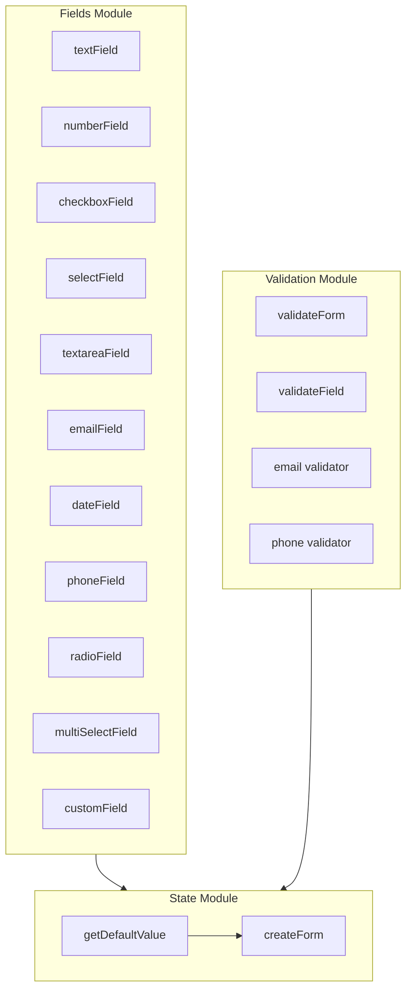

# Phase 7 — Extended Field System Implementation Plan

> **For agentic workers:** REQUIRED SUB-SKILL: Use superpowers:subagent-driven-development to implement this plan task-by-task. Steps use checkbox (`- [ ]`) syntax for tracking.

**Goal:** Expand schema coverage to support realistic enterprise form scenarios by adding textarea, email, date, phone, radio, multi-select, and custom fields along with email/phone validators.

**Architecture:** We will extend the core field types list in `src/types/field.ts`, implement separate factory files for each new field, export them from the core, update default value resolution logic in `src/state/createForm.ts`, implement new validators in `src/validation/validators.ts`, and add comprehensive unit, integration, and type-level tests.

**Architecture Diagram:**



**Tech Stack:** TypeScript, React, Vitest, Tsup

---

### Task 1: Type Definitions

**Files:**

- Modify: [src/types/field.ts](file:///home/hnpsaga/projects/makeform/src/types/field.ts)
- Test: [test/type-inference-extended.test.ts](file:///home/hnpsaga/projects/makeform/test/type-inference-extended.test.ts)

- [x] **Step 1: Write the failing type inference tests**
      Create file `test/type-inference-extended.test.ts` with tests for the new fields:

  ```ts
  import { expectTypeOf, test } from 'vitest';
  import type { InferField, InferValues } from '../src/index.js';
  import type {
    TextareaField,
    EmailField,
    DateField,
    PhoneField,
    RadioField,
    MultiSelectField,
    CustomField,
  } from '../src/types/field.js';

  test('extended single field inference works', () => {
    expectTypeOf<InferField<TextareaField>>().toEqualTypeOf<string>();
    expectTypeOf<InferField<EmailField>>().toEqualTypeOf<string>();
    expectTypeOf<InferField<DateField>>().toEqualTypeOf<Date>();
    expectTypeOf<InferField<PhoneField>>().toEqualTypeOf<string>();
    expectTypeOf<InferField<RadioField<'male' | 'female'>>>().toEqualTypeOf<'male' | 'female'>();
    expectTypeOf<InferField<MultiSelectField<'react'>>>().toEqualTypeOf<'react'[]>();
    expectTypeOf<InferField<CustomField<string>>>().toEqualTypeOf<string>();
  });
  ```

- [x] **Step 2: Run typecheck to verify it fails**
      Run: `npm run typecheck`
      Expected: FAIL with "Cannot find name 'TextareaField'" etc.
- [x] **Step 3: Modify `src/types/field.ts` with new type definitions**
      Update the imports, add new field types, and add them to `FormField` union:

  ```diff
  --- a/src/types/field.ts
  +++ b/src/types/field.ts
  @@ -30,4 +30,32 @@
     readonly options: readonly SelectOption<TValue>[];
   }

  -export type FormField = TextField | NumberField | CheckboxField | SelectField;
  +export interface TextareaField extends BaseField<string> {
  +  readonly type: 'textarea';
  +}
  +
  +export interface EmailField extends BaseField<string> {
  +  readonly type: 'email';
  +}
  +
  +export interface DateField extends BaseField<Date> {
  +  readonly type: 'date';
  +}
  +
  +export interface PhoneField extends BaseField<string> {
  +  readonly type: 'phone';
  +}
  +
  +export interface RadioField<TValue extends string = string> extends BaseField<TValue> {
  +  readonly type: 'radio';
  +  readonly options: readonly SelectOption<TValue>[];
  +}
  +
  +export interface MultiSelectField<TValue extends string = string> extends BaseField<TValue[]> {
  +  readonly type: 'multi-select';
  +  readonly options: readonly SelectOption<TValue>[];
  +}
  +
  +export interface CustomField<TValue> extends BaseField<TValue> {
  +  readonly type: 'custom';
  +}
  +
  +export type FormField =
  +  | TextField
  +  | NumberField
  +  | CheckboxField
  +  | SelectField
  +  | TextareaField
  +  | EmailField
  +  | DateField
  +  | PhoneField
  +  | RadioField
  +  | MultiSelectField
  +  | CustomField<any>;
  ```

- [x] **Step 4: Run typecheck to verify it passes**
      Run: `npm run typecheck`
      Expected: PASS
- [x] **Step 5: Commit**
  ```bash
  git add src/types/field.ts test/type-inference-extended.test.ts
  git commit -m "feat: add extended field type definitions"
  ```

---

### Task 2: Implement Primitive Fields

**Files:**

- Create: [src/fields/textarea.ts](file:///home/hnpsaga/projects/makeform/src/fields/textarea.ts)
- Create: [src/fields/email.ts](file:///home/hnpsaga/projects/makeform/src/fields/email.ts)
- Create: [src/fields/date.ts](file:///home/hnpsaga/projects/makeform/src/fields/date.ts)
- Create: [src/fields/phone.ts](file:///home/hnpsaga/projects/makeform/src/fields/phone.ts)
- Test: [test/fields/extended-primitives.test.ts](file:///home/hnpsaga/projects/makeform/test/fields/extended-primitives.test.ts)

- [x] **Step 1: Write failing tests for primitive builders**
      Create `test/fields/extended-primitives.test.ts`:

  ```ts
  import { describe, expect, test } from 'vitest';
  import { textareaField, emailField, dateField, phoneField } from '../../src/index.js';

  describe('extended primitive field builders', () => {
    test('textareaField sets correct type and accepts config', () => {
      const field = textareaField({ label: 'Bio', defaultValue: 'Hello' });
      expect(field.type).toBe('textarea');
      expect(field.label).toBe('Bio');
      expect(field.defaultValue).toBe('Hello');
    });

    test('emailField sets correct type', () => {
      const field = emailField({ label: 'Email' });
      expect(field.type).toBe('email');
      expect(field.label).toBe('Email');
    });

    test('dateField sets correct type', () => {
      const date = new Date();
      const field = dateField({ label: 'Birthday', defaultValue: date });
      expect(field.type).toBe('date');
      expect(field.defaultValue).toBe(date);
    });

    test('phoneField sets correct type', () => {
      const field = phoneField({ label: 'Phone' });
      expect(field.type).toBe('phone');
    });
  });
  ```

- [x] **Step 2: Run test to verify it fails**
      Run: `npm run test`
      Expected: FAIL (Cannot find imports/builders not defined)
- [x] **Step 3: Implement the factories**
      Create `src/fields/textarea.ts`:

  ```ts
  import type { TextareaField } from '../types/field.js';

  export type TextareaFieldConfig = Partial<Omit<TextareaField, 'type'>>;

  export function textareaField(config: TextareaFieldConfig = {}): TextareaField {
    return {
      type: 'textarea',
      ...config,
    };
  }
  ```

  Create `src/fields/email.ts`:

  ```ts
  import type { EmailField } from '../types/field.js';

  export type EmailFieldConfig = Partial<Omit<EmailField, 'type'>>;

  export function emailField(config: EmailFieldConfig = {}): EmailField {
    return {
      type: 'email',
      ...config,
    };
  }
  ```

  Create `src/fields/date.ts`:

  ```ts
  import type { DateField } from '../types/field.js';

  export type DateFieldConfig = Partial<Omit<DateField, 'type'>>;

  export function dateField(config: DateFieldConfig = {}): DateField {
    return {
      type: 'date',
      ...config,
    };
  }
  ```

  Create `src/fields/phone.ts`:

  ```ts
  import type { PhoneField } from '../types/field.js';

  export type PhoneFieldConfig = Partial<Omit<PhoneField, 'type'>>;

  export function phoneField(config: PhoneFieldConfig = {}): PhoneField {
    return {
      type: 'phone',
      ...config,
    };
  }
  ```

  And update exports in `src/fields/index.ts` and `src/index.ts`:
  Modify [src/fields/index.ts](file:///home/hnpsaga/projects/makeform/src/fields/index.ts):

  ```diff
  --- a/src/fields/index.ts
  +++ b/src/fields/index.ts
  @@ -3,3 +3,7 @@
   export { checkboxField, type CheckboxFieldConfig } from './checkbox.js';
   export { selectField, type SelectFieldConfig } from './select.js';
  +export { textareaField, type TextareaFieldConfig } from './textarea.js';
  +export { emailField, type EmailFieldConfig } from './email.js';
  +export { dateField, type DateFieldConfig } from './date.js';
  +export { phoneField, type PhoneFieldConfig } from './phone.js';
  ```

- [x] **Step 4: Run test to verify it passes**
      Run: `npm run test`
      Expected: PASS
- [x] **Step 5: Commit**
  ```bash
  git add src/fields/textarea.ts src/fields/email.ts src/fields/date.ts src/fields/phone.ts src/fields/index.ts test/fields/extended-primitives.test.ts
  git commit -m "feat: implement primitive field builders"
  ```

---

### Task 3: Implement Choice Fields

**Files:**

- Create: [src/fields/radio.ts](file:///home/hnpsaga/projects/makeform/src/fields/radio.ts)
- Create: [src/fields/multiSelect.ts](file:///home/hnpsaga/projects/makeform/src/fields/multiSelect.ts)
- Modify: [src/fields/index.ts](file:///home/hnpsaga/projects/makeform/src/fields/index.ts)
- Test: [test/fields/extended-choice.test.ts](file:///home/hnpsaga/projects/makeform/test/fields/extended-choice.test.ts)

- [x] **Step 1: Write failing tests for choice builders**
      Create `test/fields/extended-choice.test.ts`:

  ```ts
  import { describe, expect, test } from 'vitest';
  import { radioField, multiSelectField } from '../../src/index.js';

  describe('extended choice field builders', () => {
    test('radioField sets correct type and accepts options', () => {
      const field = radioField({
        label: 'Gender',
        options: [
          { label: 'Male', value: 'male' },
          { label: 'Female', value: 'female' },
        ],
      });
      expect(field.type).toBe('radio');
      expect(field.options).toHaveLength(2);
      expect(field.options[0].value).toBe('male');
    });

    test('multiSelectField sets correct type and accepts options', () => {
      const field = multiSelectField({
        label: 'Skills',
        options: [
          { label: 'React', value: 'react' },
          { label: 'Vue', value: 'vue' },
        ],
      });
      expect(field.type).toBe('multi-select');
      expect(field.options).toHaveLength(2);
    });
  });
  ```

- [x] **Step 2: Run test to verify it fails**
      Run: `npm run test`
      Expected: FAIL
- [x] **Step 3: Implement the choice field builders**
      Create `src/fields/radio.ts`:

  ```ts
  import type { RadioField } from '../types/field.js';

  export type RadioFieldConfig<TValue extends string = string> = Omit<RadioField<TValue>, 'type'>;

  export function radioField<const TValue extends string>(
    config: RadioFieldConfig<TValue>,
  ): RadioField<TValue> {
    return {
      type: 'radio',
      ...config,
    };
  }
  ```

  Create `src/fields/multiSelect.ts`:

  ```ts
  import type { MultiSelectField } from '../types/field.js';

  export type MultiSelectFieldConfig<TValue extends string = string> = Omit<
    MultiSelectField<TValue>,
    'type'
  >;

  export function multiSelectField<const TValue extends string>(
    config: MultiSelectFieldConfig<TValue>,
  ): MultiSelectField<TValue> {
    return {
      type: 'multi-select',
      ...config,
    };
  }
  ```

  And update exports in [src/fields/index.ts](file:///home/hnpsaga/projects/makeform/src/fields/index.ts):

  ```diff
  --- a/src/fields/index.ts
  +++ b/src/fields/index.ts
  @@ -7,3 +7,5 @@
   export { dateField, type DateFieldConfig } from './date.js';
   export { phoneField, type PhoneFieldConfig } from './phone.js';
  +export { radioField, type RadioFieldConfig } from './radio.js';
  +export { multiSelectField, type MultiSelectFieldConfig } from './multiSelect.js';
  ```

- [x] **Step 4: Run test to verify it passes**
      Run: `npm run test`
      Expected: PASS
- [x] **Step 5: Commit**
  ```bash
  git add src/fields/radio.ts src/fields/multiSelect.ts src/fields/index.ts test/fields/extended-choice.test.ts
  git commit -m "feat: implement choice field builders"
  ```

---

### Task 4: Implement Custom Field

**Files:**

- Create: [src/fields/custom.ts](file:///home/hnpsaga/projects/makeform/src/fields/custom.ts)
- Modify: [src/fields/index.ts](file:///home/hnpsaga/projects/makeform/src/fields/index.ts)
- Test: [test/fields/extended-custom.test.ts](file:///home/hnpsaga/projects/makeform/test/fields/extended-custom.test.ts)

- [x] **Step 1: Write failing tests for custom builder**
      Create `test/fields/extended-custom.test.ts`:

  ```ts
  import { describe, expect, test } from 'vitest';
  import { customField } from '../../src/index.js';

  describe('custom field builder', () => {
    test('customField sets correct type and wraps custom generic type', () => {
      interface Geo {
        lat: number;
        lng: number;
      }
      const field = customField<Geo>({
        label: 'Location',
        defaultValue: { lat: 0, lng: 0 },
      });
      expect(field.type).toBe('custom');
      expect(field.defaultValue).toEqual({ lat: 0, lng: 0 });
    });
  });
  ```

- [x] **Step 2: Run test to verify it fails**
      Run: `npm run test`
      Expected: FAIL
- [x] **Step 3: Implement custom field builder**
      Create `src/fields/custom.ts`:

  ```ts
  import type { CustomField } from '../types/field.js';

  export type CustomFieldConfig<TValue> = Partial<Omit<CustomField<TValue>, 'type'>>;

  export function customField<TValue>(config: CustomFieldConfig<TValue> = {}): CustomField<TValue> {
    return {
      type: 'custom',
      ...config,
    };
  }
  ```

  And update exports in [src/fields/index.ts](file:///home/hnpsaga/projects/makeform/src/fields/index.ts):

  ```diff
  --- a/src/fields/index.ts
  +++ b/src/fields/index.ts
  @@ -9,3 +9,4 @@
   export { radioField, type RadioFieldConfig } from './radio.js';
   export { multiSelectField, type MultiSelectFieldConfig } from './multiSelect.js';
  +export { customField, type CustomFieldConfig } from './custom.js';
  ```

- [x] **Step 4: Run test to verify it passes**
      Run: `npm run test`
      Expected: PASS
- [x] **Step 5: Commit**
  ```bash
  git add src/fields/custom.ts src/fields/index.ts test/fields/extended-custom.test.ts
  git commit -m "feat: implement custom field builder"
  ```

---

### Task 5: Implement Email and Phone Validators

**Files:**

- Modify: [src/validation/validators.ts](file:///home/hnpsaga/projects/makeform/src/validation/validators.ts)
- Modify: [src/validation/index.ts](file:///home/hnpsaga/projects/makeform/src/validation/index.ts)
- Test: [test/validation/extended-validators.test.ts](file:///home/hnpsaga/projects/makeform/test/validation/extended-validators.test.ts)

- [x] **Step 1: Write failing tests for email and phone validators**
      Create `test/validation/extended-validators.test.ts`:

  ```ts
  import { describe, expect, test } from 'vitest';
  import { email, phone } from '../../src/index.js';

  describe('email validator', () => {
    test('passes for valid email formats', () => {
      expect(email()('test@example.com')).toBeNull();
      expect(email()('user.name+label@sub.domain.org')).toBeNull();
    });

    test('fails for invalid email formats', () => {
      expect(email()('invalidemail')).toBe('Invalid email format');
      expect(email()('test@')).toBe('Invalid email format');
      expect(email()('test@domain')).toBe('Invalid email format');
    });

    test('uses custom error message', () => {
      expect(email('Bad email')('invalid')).toBe('Bad email');
    });
  });

  describe('phone validator', () => {
    test('passes for valid phone formats', () => {
      expect(phone()('1234567')).toBeNull();
      expect(phone()('+1 (555) 123-4567')).toBeNull();
      expect(phone()('123-456-7890')).toBeNull();
    });

    test('fails for invalid phone formats', () => {
      expect(phone()('abc')).toBe('Invalid phone number format');
      expect(phone()('12')).toBe('Invalid phone number format');
    });

    test('uses custom error message', () => {
      expect(phone('Bad phone')('invalid')).toBe('Bad phone');
    });
  });
  ```

- [x] **Step 2: Run test to verify it fails**
      Run: `npm run test`
      Expected: FAIL
- [x] **Step 3: Implement new validators in `src/validation/validators.ts`**
      Modify [src/validation/validators.ts](file:///home/hnpsaga/projects/makeform/src/validation/validators.ts):
  ```diff
  --- a/src/validation/validators.ts
  +++ b/src/validation/validators.ts
  @@ -72,2 +72,20 @@
   export function custom<T>(fn: (value: T) => string | null): Validator<T> {
     return fn;
   }
  +
  +/**
  + * Validates a standard email format.
  + */
  +export function email(message?: string): Validator<string> {
  +  const emailRegex = /^[^\s@]+@[^\s@]+\.[^\s@]+$/;
  +  return (value: string): string | null => {
  +    return emailRegex.test(value) ? null : (message ?? 'Invalid email format');
  +  };
  +}
  +
  +/**
  + * Validates a simple phone number format.
  + */
  +export function phone(message?: string): Validator<string> {
  +  const phoneRegex = /^\+?[0-9\s\-()]{7,20}$/;
  +  return (value: string): string | null => {
  +    return phoneRegex.test(value) ? null : (message ?? 'Invalid phone number format');
  +  };
  +}
  ```
  And update exports in [src/validation/index.ts](file:///home/hnpsaga/projects/makeform/src/validation/index.ts):
  ```diff
  --- a/src/validation/index.ts
  +++ b/src/validation/index.ts
  @@ -2,3 +2,5 @@
   export * from './validateField.js';
   export * from './validateForm.js';
   export { required, min, max, pattern, custom } from './validators.js';
  +export { email, phone } from './validators.js';
  ```
- [x] **Step 4: Run test to verify it passes**
      Run: `npm run test`
      Expected: PASS
- [x] **Step 5: Commit**
  ```bash
  git add src/validation/validators.ts src/validation/index.ts test/validation/extended-validators.test.ts
  git commit -m "feat: add email and phone validators"
  ```

---

### Task 6: Update Default Value Resolution

**Files:**

- Modify: [src/state/createForm.ts](file:///home/hnpsaga/projects/makeform/src/state/createForm.ts)
- Test: [test/state/extended-createForm.test.ts](file:///home/hnpsaga/projects/makeform/test/state/extended-createForm.test.ts)

- [x] **Step 1: Write tests for default value resolution of new fields**
      Create `test/state/extended-createForm.test.ts`:

  ```ts
  import { describe, expect, test, vi } from 'vitest';
  import {
    createForm,
    textareaField,
    emailField,
    dateField,
    phoneField,
    radioField,
    multiSelectField,
    customField,
  } from '../../src/index.js';

  describe('createForm with extended fields', () => {
    test('resolves default values correctly', () => {
      vi.useFakeTimers();
      const now = new Date();
      vi.setSystemTime(now);

      const schema = {
        bio: textareaField(),
        email: emailField(),
        birthday: dateField(),
        phone: phoneField(),
        gender: radioField({
          options: [
            { label: 'Male', value: 'male' },
            { label: 'Female', value: 'female' },
          ],
        }),
        skills: multiSelectField({
          options: [{ label: 'React', value: 'react' }],
        }),
        loc: customField<{ lat: number; lng: number }>(),
      };

      const form = createForm(schema);
      const values = form.getValues();

      expect(values.bio).toBe('');
      expect(values.email).toBe('');
      expect(values.birthday.getTime()).toBe(now.getTime());
      expect(values.phone).toBe('');
      expect(values.gender).toBe('male');
      expect(values.skills).toEqual([]);
      expect(values.loc).toBeUndefined();

      vi.useRealTimers();
    });

    test('uses custom defaultValue if supplied', () => {
      const customDate = new Date(2000, 0, 1);
      const schema = {
        birthday: dateField({ defaultValue: customDate }),
        gender: radioField({
          defaultValue: 'female',
          options: [
            { label: 'Male', value: 'male' },
            { label: 'Female', value: 'female' },
          ],
        }),
        skills: multiSelectField({
          defaultValue: ['react'],
          options: [{ label: 'React', value: 'react' }],
        }),
      };

      const form = createForm(schema);
      const values = form.getValues();

      expect(values.birthday).toBe(customDate);
      expect(values.gender).toBe('female');
      expect(values.skills).toEqual(['react']);
    });
  });
  ```

- [x] **Step 2: Run test to verify it fails**
      Run: `npm run test`
      Expected: FAIL (Cannot resolve defaults for the new field types, resulting in undefined)
- [x] **Step 3: Update default values resolution in `src/state/createForm.ts`**
      Modify [src/state/createForm.ts](file:///home/hnpsaga/projects/makeform/src/state/createForm.ts):
  ```diff
  --- a/src/state/createForm.ts
  +++ b/src/state/createForm.ts
  @@ -11,9 +11,18 @@
     switch (field.type) {
       case 'text':
  +    case 'textarea':
  +    case 'email':
  +    case 'phone':
         return '';
       case 'number':
         return 0;
       case 'checkbox':
         return false;
       case 'select':
  +    case 'radio':
         return field.options?.[0]?.value ?? '';
  +    case 'date':
  +      return new Date();
  +    case 'multi-select':
  +      return [];
       default:
         return undefined;
     }
   }
  ```
- [x] **Step 4: Run test to verify it passes**
      Run: `npm run test`
      Expected: PASS
- [x] **Step 5: Commit**
  ```bash
  git add src/state/createForm.ts test/state/extended-createForm.test.ts
  git commit -m "feat: support extended fields in default value resolution"
  ```

---

### Task 7: Update Entry Point Exports

**Files:**

- Modify: [src/types/index.ts](file:///home/hnpsaga/projects/makeform/src/types/index.ts)

- [x] **Step 1: Check imports in test file**
      Modify type-inference test file to import new field types from main entrypoint rather than raw types directory.
      Update [test/type-inference-extended.test.ts](file:///home/hnpsaga/projects/makeform/test/type-inference-extended.test.ts):
  ```diff
  --- a/test/type-inference-extended.test.ts
  +++ b/test/type-inference-extended.test.ts
  @@ -2,11 +2,11 @@
   import type { InferField, InferValues } from '../src/index.js';
  -import type {
  -  TextareaField,
  -  EmailField,
  -  DateField,
  -  PhoneField,
  -  RadioField,
  -  MultiSelectField,
  -  CustomField,
  -} from '../src/types/field.js';
  +import type {
  +  TextareaField,
  +  EmailField,
  +  DateField,
  +  PhoneField,
  +  RadioField,
  +  MultiSelectField,
  +  CustomField,
  +} from '../src/index.js';
  ```
- [x] **Step 2: Run typecheck to verify it fails**
      Run: `npm run typecheck`
      Expected: FAIL on cannot find module exports from index
- [x] **Step 3: Update `src/types/index.ts` to export all new fields**
      Modify [src/types/index.ts](file:///home/hnpsaga/projects/makeform/src/types/index.ts):
  ```diff
  --- a/src/types/index.ts
  +++ b/src/types/index.ts
  @@ -1,2 +1,11 @@
  -export type { BaseField, TextField, NumberField, CheckboxField, SelectField, FormField } from './field.js';
  +export type {
  +  BaseField,
  +  TextField,
  +  NumberField,
  +  CheckboxField,
  +  SelectField,
  +  TextareaField,
  +  EmailField,
  +  DateField,
  +  PhoneField,
  +  RadioField,
  +  MultiSelectField,
  +  CustomField,
  +  FormField,
  +} from './field.js';
   export type { InferField, InferValues } from './inference.js';
  ```
- [x] **Step 4: Run typecheck to verify it passes**
      Run: `npm run typecheck`
      Expected: PASS
- [x] **Step 5: Commit**
  ```bash
  git add src/types/index.ts test/type-inference-extended.test.ts
  git commit -m "feat: export extended field types from index"
  ```

---

### Task 8: Update README Documentation

**Files:**

- Modify: [README.md](file:///home/hnpsaga/projects/makeform/README.md)

- [x] **Step 1: Document new field builders and validators in README**
      Modify [README.md](file:///home/hnpsaga/projects/makeform/README.md) to add documentation and examples for `textareaField`, `emailField`, `dateField`, `phoneField`, `radioField`, `multiSelectField`, `customField`, `email()`, and `phone()`.
  ```diff
  --- a/README.md
  +++ b/README.md
  @@ -99,4 +99,10 @@
   | `required()`           | any        | Fails for `null`, `undefined`, or empty/whitespace strings        |
  +| `email(msg?)`          | `string`   | Fails if value is not a valid email address                       |
  +| `phone(msg?)`          | `string`   | Fails if value is not a valid phone number                        |
   | `min(n)`               | `string`   | Fails if string length < `n`                                      |
  ```
- [x] **Step 2: Run prettier to verify format**
      Run: `npx prettier --check .`
      Expected: PASS
- [x] **Step 3: Commit**
  ```bash
  git add README.md
  git commit -m "docs: document extended fields and validators in README"
  ```
