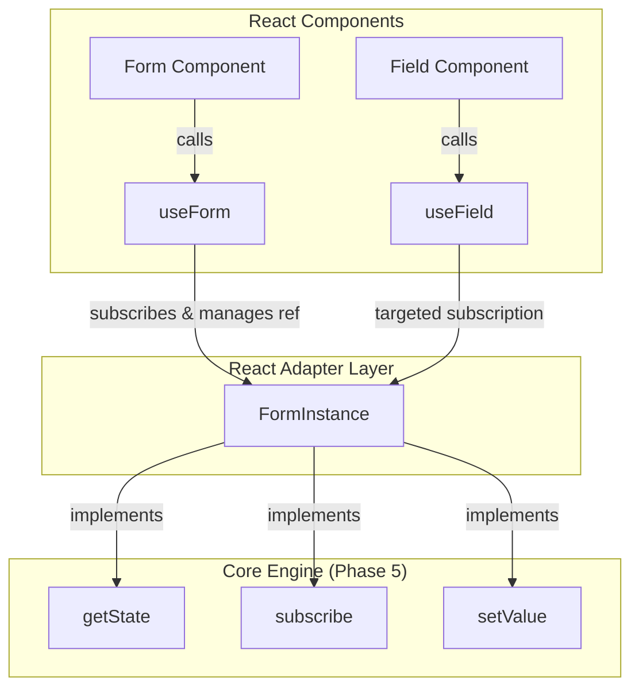

# Design Document: MakeForm React Adapter (Phase 6)

## Overview

This design document describes the integration layer for using MakeForm in React applications.
The React adapter provides two hooks: `useForm` and `useField`. The integration is built on top of the existing `createForm` core engine, utilizing `useSyncExternalStore` for robust and efficient subscriptions.

---

## Architecture & Data Flow



### 1. Exposing Core State (`getState`)

To avoid duplicating state, validation, or tracking logic, we extend the core `FormInstance` with a `getState()` method.
This method returns a shallow copy of the current state:

```ts
export interface FormState<TValues> {
  values: TValues;
  errors: Record<string, string[]>;
  touched: Record<keyof TValues, boolean>;
  dirty: Record<keyof TValues, boolean>;
}
```

### 2. `useForm` Hook

The `useForm` hook:

- Instantiates `createForm` only once across renders.
- Subscribes the parent component to all state changes of the form, ensuring that any component consuming the form directly gets updated.
- Exposes the full `FormInstance` API.

### 3. `useField` Hook (Targeted Subscriptions)

The `useField` hook:

- Subscribes to the form's updates.
- Uses custom memoization logic in the snapshot selector of `useSyncExternalStore` to return a stable reference of the field's slice (`{ value, errors, touched, dirty }`).
- Prevents components that only consume `useField` from re-rendering unless the specific field's values, errors, touched, or dirty states change.

---

## Detailed Specifications

### Core API Extensions

#### `src/state/types.ts`

```ts
export interface FormInstance<TSchema extends Record<string, any>> {
  getValues(): InferValues<TSchema>;
  getValue<K extends keyof InferValues<TSchema>>(field: K): InferValues<TSchema>[K];
  setValue<K extends keyof InferValues<TSchema>>(field: K, value: InferValues<TSchema>[K]): void;
  validate(): ValidationResult;
  reset(): void;
  subscribe(listener: Listener<InferValues<TSchema>>): () => void;
  unsubscribe(listener: Listener<InferValues<TSchema>>): void;
  // New API
  getState(): FormState<InferValues<TSchema>>;
}
```

#### `src/state/createForm.ts`

```ts
export function createForm<TSchema extends Record<string, any>>(
  schema: TSchema,
): FormInstance<TSchema> {
  // ...
  return {
    // ...
    getState() {
      return {
        values: { ...state.values },
        errors: { ...state.errors },
        touched: { ...state.touched },
        dirty: { ...state.dirty },
      };
    },
  };
}
```

### React Adapter API

#### `src/react/types.ts`

```ts
export interface FieldState<TValue> {
  value: TValue;
  errors: string[];
  touched: boolean;
  dirty: boolean;
  setValue: (value: TValue) => void;
}
```

#### `src/react/useForm.ts`

```ts
import { useRef, useSyncExternalStore } from 'react';
import { createForm } from '../state/createForm.js';
import type { FormInstance } from '../state/types.js';

export function useForm<TSchema extends Record<string, any>>(
  schema: TSchema,
): FormInstance<TSchema> {
  const formRef = useRef<FormInstance<TSchema> | null>(null);
  if (!formRef.current) {
    formRef.current = createForm(schema);
  }
  const form = formRef.current;

  useSyncExternalStore(
    form.subscribe,
    () => form.getState(),
    () => form.getState(),
  );

  return form;
}
```

#### `src/react/useField.ts`

```ts
import { useSyncExternalStore, useRef, useCallback } from 'react';
import type { FormInstance } from '../state/types.js';
import type { InferValues } from '../types/inference.js';
import type { FieldState } from './types.js';

export function useField<
  TSchema extends Record<string, any>,
  K extends keyof InferValues<TSchema> & string,
>(form: FormInstance<TSchema>, name: K): FieldState<InferValues<TSchema>[K]> {
  type TValue = InferValues<TSchema>[K];
  const cachedStateRef = useRef<FieldState<TValue> | null>(null);

  const getSnapshot = () => {
    const fullState = form.getState();
    const value = fullState.values[name] as TValue;
    const errors = fullState.errors[name] || [];
    const touched = fullState.touched[name] || false;
    const dirty = fullState.dirty[name] || false;

    if (cachedStateRef.current) {
      const current = cachedStateRef.current;
      const errorsChanged =
        current.errors.length !== errors.length ||
        current.errors.some((err, i) => err !== errors[i]);

      if (
        current.value === value &&
        !errorsChanged &&
        current.touched === touched &&
        current.dirty === dirty
      ) {
        return current;
      }
    }

    const nextState: FieldState<TValue> = {
      value,
      errors,
      touched,
      dirty,
      setValue: (val: TValue) => form.setValue(name, val),
    };
    cachedStateRef.current = nextState;
    return nextState;
  };

  const setValue = useCallback(
    (value: TValue) => {
      form.setValue(name, value);
    },
    [form, name],
  );

  const fieldState = useSyncExternalStore(form.subscribe, getSnapshot, getSnapshot);

  return {
    ...fieldState,
    setValue,
  };
}
```

---

## Test & Verification Plan

### 1. Functional Tests (Vitest + React Testing Library)

We will create `test/react/react.test.tsx` (using `jsdom` environment) to cover:

- Rendering with `useForm` and `useField`.
- Rerender verification (targeted re-renders on fields vs full form).
- Integration with validation, `dirty`, `touched`, and state reset.
- Clean unmounting (ensuring no memory leaks or subscription listeners left behind).

### 2. Type Inference Tests

We will create type checks inside the test file using `expectTypeOf()` to verify:

- Typings for schema variables in `useForm`.
- Correct value type inferred in `useField` and its `setValue` function.
- No `any` or typescript regressions.
